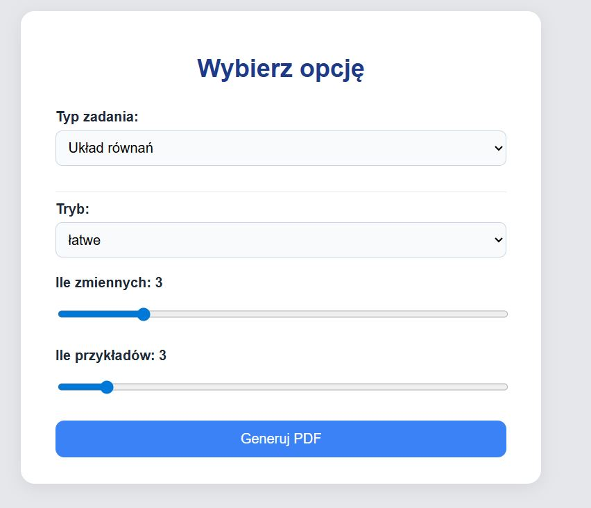
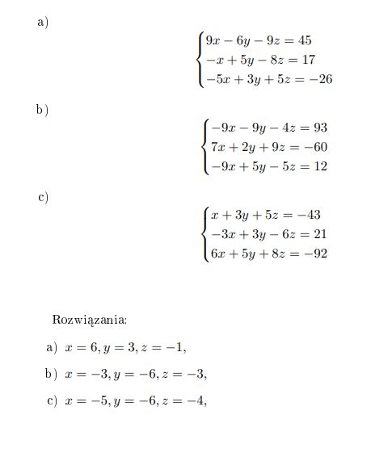

## Generator zadań z matematyki

https://generator-zadan.fly.dev

Aplikacja umożliwia tworzenie niektórych spośród bardziej schematycznych zadań matematycznych z poziomu *szkoły podstawowej* i *szkoły średniej*, między innymi **układy równań**, **równania kwadratowe** i **działania na ułamkach**. Do każdego przykładu podane jest też prawidłowe **rozwiązanie**.

Przykład działania aplikacji:

## Techniki i narzędzia wykorzystane w projekcie:
- **Języki:** Python, HTML, LaTeX
-  **Biblioteki:** `flask`, `sympy`, `shutil`
